# AquaGuard Platform Control Plane

## Architecture decision record

AquaGuard is intentionally split into a **simulation plane** and a future **integration plane**. The simulation plane contains synthetic workloads, deterministic failure injection, release evidence, policy evaluation, and operator decisions. It is the only plane enabled in this repository. A future integration plane would require separate credentials, tenant authorization, environment allowlists, read-only observability adapters, and an explicit change-management contract.

```mermaid
flowchart LR
  C[Commit] --> B[Build + Test]
  B --> A[Artifact + SBOM]
  A --> P[Provenance + Policy]
  P --> R[Progressive Rollout]
  R --> O[OTel Metrics Logs Traces]
  O --> G[SLO / Error Budget Gate]
  G --> H[Human Approval]
  H --> X[Simulated Action]
  X --> L[Hash-linked Audit Ledger]
```

The release graph is evidence-first. Every transition carries a release ID, commit, artifact digest, environment, policy version, rollout stage, telemetry correlation ID, and actor decision. The platform never treats an AI recommendation as an action. The recommendation is an input to a human-controlled state transition.

## Threat model

| Threat | Boundary | Mitigation |
|---|---|---|
| AI proposes an unsafe rollback | AI advisor → operator action | Hard approval gate, mandatory rationale, explicit confirmation, audit event |
| Mutable or untrusted artifact enters rollout | Registry evidence → policy gate | Digest requirement, signature/provenance checks, SBOM evidence, policy pack |
| Synthetic UI is mistaken for production | Demo surface → user interpretation | Persistent simulation disclaimer, no production connectors, CI boundary scan |
| Desired state silently changes cluster | GitOps intent → observed state | Drift detection, reconciliation preview, simulator-only mutation |
| Telemetry hides a release regression | Rollout → decision gate | Stage-linked metrics, logs, traces, burn-rate windows, error-budget display |
| Audit history is altered | Operator event → governance record | Hash-linked records, chain verification tests, actor and rationale fields |
| Stale approval is reused | Approval request → destructive action | TTL-based expiry helper and explicit confirmation step |

## Production-hardening path

Before any real integration, replace synthetic providers independently: an OpenTelemetry collector for signals, a read-only Kubernetes adapter for observed state, an artifact registry adapter for immutable metadata, and a Git provider for desired state. Each adapter must be disabled by default outside an explicitly named non-production environment. The simulator remains the reference implementation for contract tests and failure scenarios.
